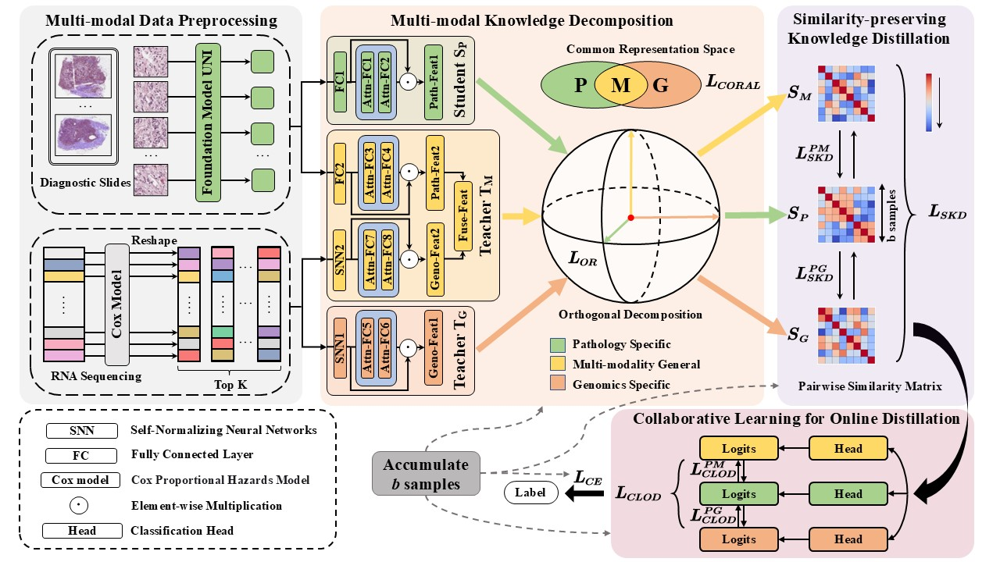

# Multi-modal Knowledge Decomposition based Online Distillation for Biomarker Prediction in Breast Cancer Histopathology

This repository is an official PyTorch implementation of the paper "Multi-modal Knowledge Decomposition based Online Distillation for Biomarker Prediction in Breast Cancer Histopathology" from MICCAI 2025.


## framework
 <p align="center">
  
 </p>

## Environment
Pytorch 2.0.1
Python 3.9


 ### Run code

```
python train_kd.py --weighted_sample --early_stopping 
```

